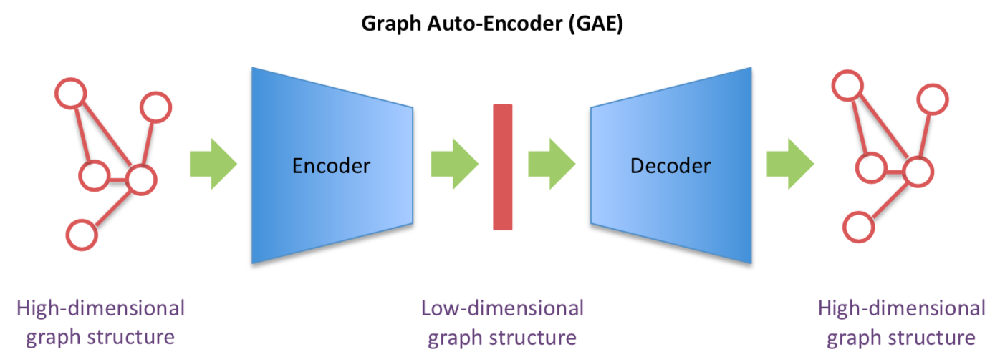

# GraphGenerator
Graph generator project using a graph autoencoder

## Data
Dataset: NASA astronomical dataset in XML form\
Source: XML Data Repository on the Computer Science & Engineering of the University of Washington\
Details: 2435 reports with titles, authors, paragraphs, definitions, units, etc. marked

## File documentation
### preprocess
**split_xml.py** creates separate XML files and outputs a total of 2435 XML reports from ‘xml/nasa.xml’ into the folder xml/nasa’.\
**edge_parser.py** parses all the XML files in the folder xml/nasa’ and outputs edge integer vectors for each file in the folder ‘output/edges’.\
**vector_parser.py** parses all the XML files in the folder xml/nasa’ and outputs text vectors representative of node features for each file in the folder ‘output/txt_vectors’.\
**vectorize.py** parses all the text vectors in the folder ‘output/txt_vectors’ and outputs text embedding vectors (using spacy) for each text vector in the folder ‘output/vectors’.

## Model architecture

